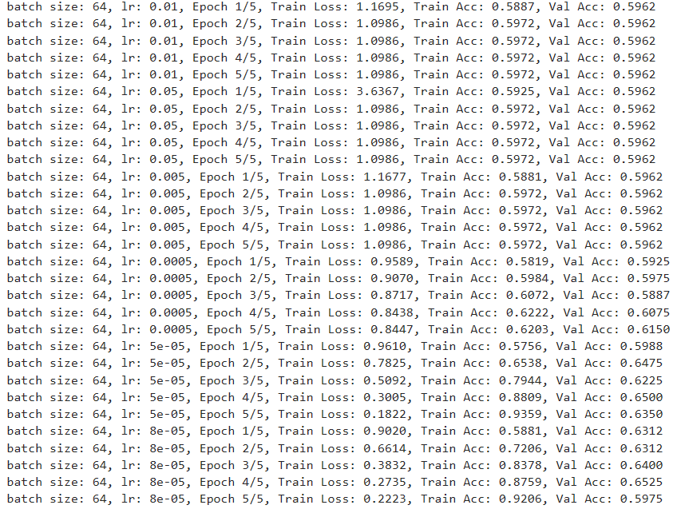
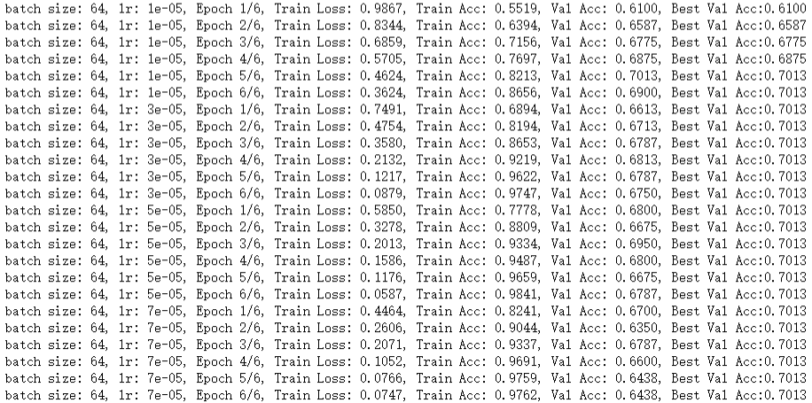
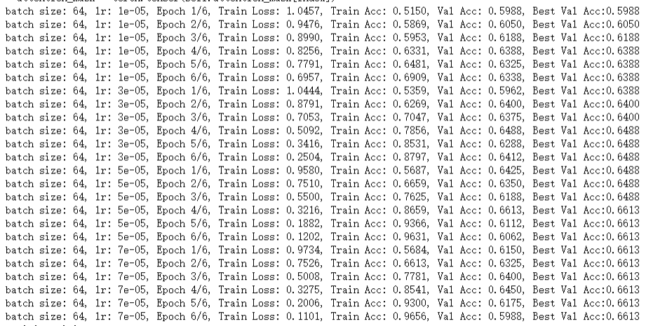
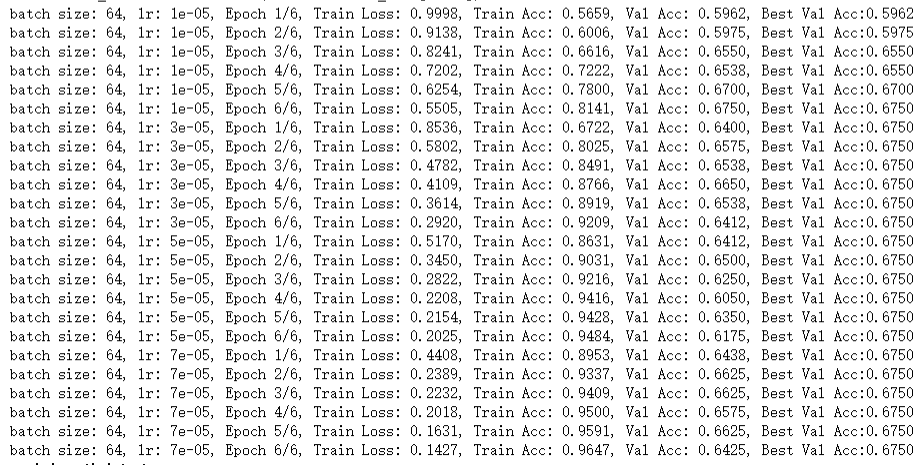
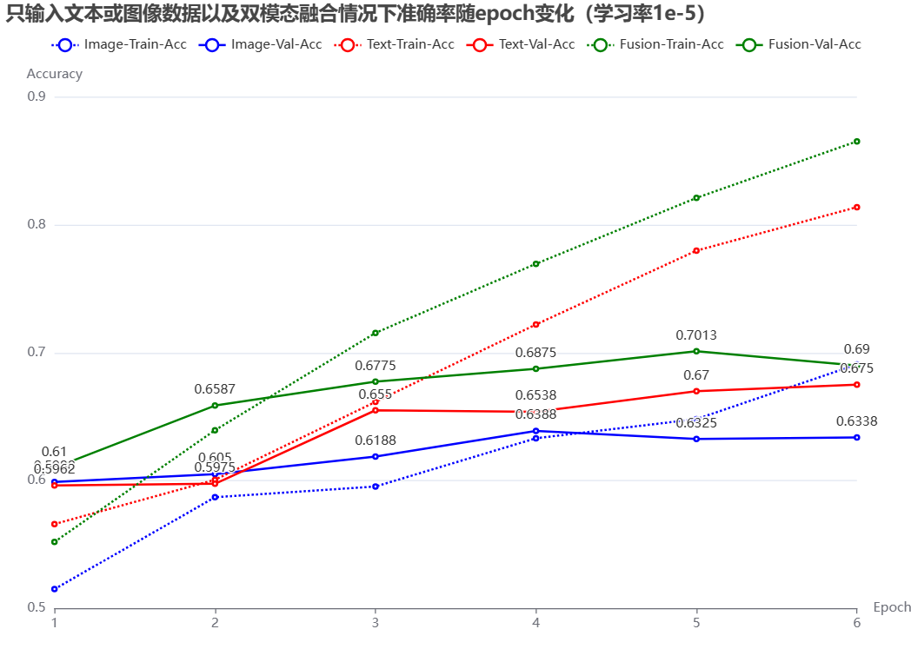
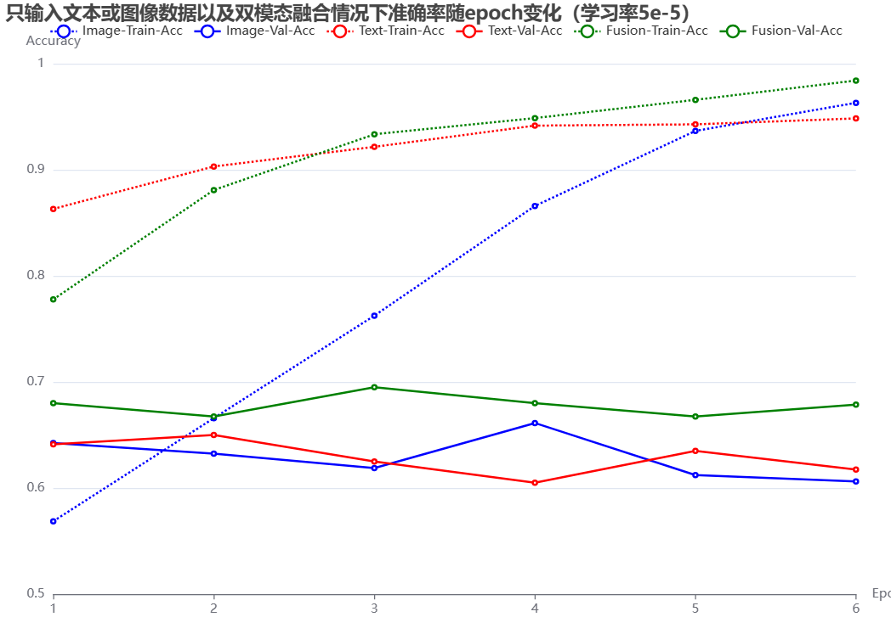

# **华东师范大学数据科学与工程学院实验报告**

| **课程名称**：当代人工智能 |**年级** ：20级 | **上机实践成绩** ： |
| --- | --- | --- |
| **指导教师** ：李翔 | **姓名** ：陈沁文 | **学号** ：10205501409 |
| **上机实践名称**：多模态情感分析 |**上机实践日期**：2023.7.1 |
| **上机实践编号** ：5 | **组号**： |**上机实践时间**： |

## **一、实验目的**
给定配对的文本和图像，预测对应的情感标签（三分类任务：positive, neutral, negative）。

## **二、实验任务**
- 设计一个多模态融合模型。
- 自行从训练集中划分验证集，调整超参数。
- 预测测试集（test_without_label.txt）上的情感标签。

## **三、实验环境**
torch 1.10.1 
torchvision 0.11.2+cu113
cuda 11.3 
transformers 4.30.2
sklearn 1.0.2
使用3090-24G的显卡

## **四、模型设计**

##### 多模态融合模型
多模态融合模型是指将来自不同模态（例如图像、文本、音频等）的信息进行整合和处理的模型。这种模型能够同时处理多种类型的输入数据，并将它们的特征结合起来，以获得更全面、准确的信息表示和更好的性能。

多模态融合模型的设计和实现主要包括：
- 特征提取：针对不同的模态数据，需要使用相应的技术来提取特征。
- 特征融合：在将不同模态的特征结合起来前，需要对它们的维度进行对齐或降维操作，使得它们在特征空间中具有相同的维度。然后，可以使用简单的拼接操作、加权融合、堆叠或注意力机制等方式将这些特征融合在一起。
- 训练和优化
多模态融合模型在许多任务上都显示出优越的表现，例如图像标注、文本到图像生成、音频情感分析等。它可以利用多个模态的互补信息，提取更细粒度、更全面的特征表示，从而增强模型的能力性能。

##### 模型构架：
本代码中用于实现情感分析分类的文本和图像双模态融合模型FusionModel设计由图片特征提取模型ImageFeatureExtractor和文本特征提取模型TextFeatureExtractor组成。
分别将处理过的图像数据和文本数据输入到对应特征提取模型中，将所得特征在同一维度上拼接实现融合，最后通过两层Dropout-Linear-ReLU对融合后的特征向量转换到分类类别数。其中，ImageFeatureExtractor将图像输入进ResNet50模型获取图像特征，TextFeatureExtractor将分词器tokenizer处理后的文本数据input_ids以及attention_mask输入进Bert适用于多语言的bert-base-multilingual-cased预训练模型，将代表句子表征的pooled_output作为文本特征输出。

##### ResNet50模型
torchvision.models模块中包含许多预训练的图像分类模型，包括在ImageNet数据集上 进行了预训练的ResNet50模型。该模型的输入是RGB图像，输入形状为(batch_size,3,image_size,image_size)，输出为长度为1000的一维向量，每个位置上的值表示对应类别的概率。

##### BERT模型
**BERT**是一种基于Transformer架构的预训练语言模型，由Google在2018年提出。BERT在自然语言处理领域取得了巨大的突破并广泛应用于各种NLP任务，如文本分类、命名实体识别、文本生成等。BERT模型的核心思想是使用自监督学习的方式对大规模的文本数据进行预训练，通过学习输入句子中的上下文信息，产生高质量的词向量表示。BERT模型采用了双向的Transformer网络结构，通过多层的自注意力机制来捕捉文本中的上下文关系。

**Tokenizer**是BERT模型的重要组件，用于将文本数据进行预处理，转换为BERT模型可以处理的输入数据。具体表现为将文本切分成子词token，并映射为词汇表中的唯一的ID，即将文本转换为一个整数序列input_ids，同时tokenizer具备截断或填充功能保证输入序列的长度一致,输出二进制序列注意力掩码attention_mask，用于指示真实数据和填充数据的部分。
BERT模型的输出
在使用BERT模型进行文本分类训练时，一般可以使用两种方法进行文本特征提取：使用last hidden state或使用pooler output。

1. **Last Hidden State**：BERT模型的最后隐藏状态是指最后一层Transformer的输出，它包含了输入序列的所有信息。使用最后隐藏状态作为文本特征可以较为直接地捕捉每个词的上下文信息，但在某些情况下可能会不够表达整个句子的语义。

2. **Pooler Output**：BERT模型中的`[CLS]`符号表示句子的整体特征，它对整个句子的表示进行了汇总。而pooler output即取`[CLS]`标记处对应的embedding向量后接个全连接层再接tanh激活后的输出,可以理解为句子语义的特征向量表示。pooler output可以更好地表示整个句子的语义，并且减少了模型参数的数量。

综上可得在情感分析分类问题上选取Pooler Output提取文本特征更合适。

##### 融合：拼接
将来自不同模态的特征向量直接拼接，使其均映射到一个统一的表示空间，实现模态之间的信息交互和融合，因而模型可以从多个模态中学习到更丰富和综合的特征表示。同时，拼接简化了模型的结构和设计，模型的参数和计算量少，有利于模型训练和优化。
如在代码中通过`torch.cat((text_features,image_features), dim=-1)`,将形状为（batch_size,768）的文本特征text_features和形状为（batch_size,1000）的图像特征image_features在最后一个维度上拼接生成形状为(batch_size,1768)fusion_features。后续将融合特征fusion_features通过全连接层和Relu激活，得到具有对应类别的概率的输出向量。

## **五、实验过程**

#### 遇到的问题
文本读取问题，一开始使用gbk编码读取文件发现报错，究其原因是文本文件涉及多语言、采用的编码方式也各不相同，只用一种固定编码无法适应。然而在尝试调用chardet库，依次解析不同文件的编码格式并用其解码，却发现也会报错。例如当使用的是对应的字符编码（如GB2312）进行处理，由于文本中夹杂的部分特殊字符，因而仍会报错。于是最后通过选取与当前编码兼容但包含更多字符的编码GB18030去解码解决问题。（编码格式包含字符个数比较：GB2312< GBK < GB18030）

#### 实验结果

##### 多模态融合模型
经实验，发现在批大小为256、128、64、32、16之间，验证集上准确率区别不大，于是选取64作为固定的batch size。
之后分别调节学习率参数，在[1e-2,5e-2,5e-3,5e-4,5e-5,8e-5]的范围上训练，通过对比训练集和验证集上的准确率，表明设置学习率在1e-2 ~ 5e-3之间过高，此时的训练集和验证集的准确率难以提升，几乎无变化，模型在训练过程中可能跳过了最优解。而当学习率设置在5e-5 ~ 8e-5之间较为合理，可以看到模型拟合了训练集上的数据，验证集上的准确率也有一定提升。不过，同时可以发现训练集准确率和验证机准确率差别较大，判断为过拟合，可以通过增加dropout层和添加正则化项降低过拟合。

下图为学习率设置在[1e-5,3e-5,5e-5,7e-5]的范围上训练结果，验证集上准确率最高可以达到0.7013

##### 消融实验
分别只输入图像数据以及文本数据，在各自获取的特征向量的基础上进行全连接层的转换。
只输入图像数据的训练结果

只输入文本数据的训练结果

下图为两者与特征融合的情况的对比结果，可以发现只输入图像或只输入文本数据，模型依然可以学习到一定特征，验证集上的准确率随Epoch大体呈上升趋势，在训练集准确率较高、即过拟合时略微下降。但两者的验证集准确率均略低于融合模型，说明多模态融合模型相比单一模态输入的模型，能够将多种输入的特征结合起来，获得更全面、准确的特征表示，模型性能更强。

## **六、总结**
通过这次实验，对多模态融合模型有了一定的认识和理解，并通过简单的融合模型设计实现通过文本和图像的多模态情感分析分类问题，通过训练结果的分析，认识到多模态融合模型相比于单一模态模型的优越表现。不足是没有进一步探索融合模型的多种融合方式，如加权融合或注意力机制。其实在写代码时尝试过在融合特征后在模型内加入一层自注意力层，但是发现训练效果不佳，怀疑是没写对，故而暂放弃实现。